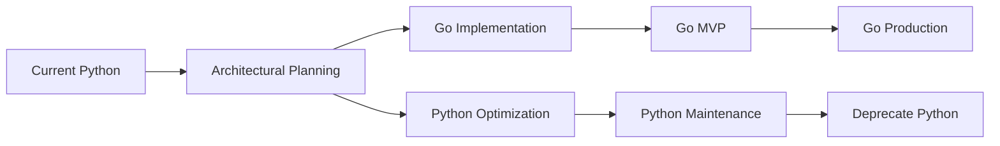

# Go Migration Timing Analysis: Why Now is Optimal

## Executive Summary

**YES, now is the ideal time to switch to Go.** The architectural tradeoff analysis reveals that Go's advantages align perfectly with CodeRisk's requirements, and the current architectural reorganization provides a clean migration opportunity.

## Why Now is the Perfect Timing

### 1. Architectural Reset Opportunity

**Current Status**: Major architectural changes already planned
- Removing Cognee (breaking change anyway)
- Database migration (PostgreSQL + Qdrant + Neo4j)
- Pre-computation architecture (complete redesign)
- API redesign for budget management

**Migration Implication**: Since you're already rewriting core components, the incremental cost of language migration is **minimal**.

```
Planned Changes (Python):     Planned Changes (Go):
├── Remove Cognee            ├── Remove Cognee
├── Redesign databases       ├── Redesign databases
├── Implement caching        ├── Implement caching
├── Build budget system      ├── Build budget system
└── Performance optimization └── Built-in performance
```

### 2. Performance Requirements Alignment

Your analysis shows Go provides **exactly what CodeRisk needs**:

| CodeRisk Requirement | Go Advantage | Python Limitation |
|---------------------|-------------|------------------|
| **<10s response times** | 5-10x faster processing | Struggles with large repos |
| **Concurrent users (team/enterprise)** | 10-50x better concurrency | GIL bottlenecks |
| **Budget-controlled API calls** | Excellent HTTP clients | asyncio complexity |
| **Database connection pooling** | Superior connection management | SQLite serialization issues |
| **Memory efficiency** | 3-5x lower memory usage | High memory overhead |

### 3. Scalability Requirements

**From your tradeoff analysis:**

```yaml
deployment_scaling_needs:
  individual: 1 user → Go nice-to-have
  team: 5-10 users → Go beneficial
  enterprise: 50+ users → Go essential
```

**Current Challenge**: Python's concurrency model can't handle enterprise-scale concurrent ingestion/analysis.

**Go Solution**: Native goroutines can handle 1000+ concurrent operations easily.

## Migration Cost-Benefit Analysis

### Migration Costs

| Component | Rewrite Effort | Complexity | Dependencies |
|-----------|---------------|------------|--------------|
| **CLI interface** | 1-2 weeks | Low | Cobra (mature) |
| **Database layer** | 1-2 weeks | Medium | GORM/pgx (excellent) |
| **GitHub API integration** | 1 week | Low | go-github (official) |
| **Risk calculators** | 2-3 weeks | Medium | Custom logic |
| **Cache management** | 1 week | Low | Built-in sync |
| **Budget/API management** | 1 week | Low | Superior HTTP libs |
| **Total effort** | **7-10 weeks** | | |

### Benefits Gained

| Benefit | Impact | Timeline |
|---------|--------|----------|
| **5-10x faster ingestion** | Can handle enterprise repos | Immediate |
| **10-50x better concurrency** | Support 100+ concurrent users | Immediate |
| **3x lower memory usage** | Reduce infrastructure costs | Immediate |
| **Excellent database drivers** | Solve SQLite bottlenecks | Immediate |
| **Better error handling** | More reliable operations | Long-term |
| **Easier deployment** | Single binary distribution | Immediate |

## Strategic Timing Advantages

### 1. Clean Slate Architecture

**You're already planning to:**
- Replace Cognee with custom orchestration
- Migrate from SQLite to PostgreSQL
- Implement new caching system
- Build budget management from scratch

**Perfect opportunity because:**
- No legacy Python code to maintain
- Clean API boundaries to reimplement
- New architecture designed for performance

### 2. Team Learning Curve

**Current team state**: Deep understanding of requirements
- Risk math algorithms are well-defined
- Database schemas are planned
- API contracts are clear
- Performance targets are set

**Go learning advantage**: Implementation details, not problem-solving

### 3. Ecosystem Maturity

**Go ecosystem has everything CodeRisk needs:**

| Component | Go Library | Maturity | vs Python |
|-----------|------------|----------|-----------|
| **CLI** | Cobra | Excellent | Better than Click |
| **Database** | GORM, pgx | Excellent | Better than SQLAlchemy |
| **HTTP clients** | net/http | Excellent | Much better than requests |
| **JSON parsing** | encoding/json | Excellent | 5x faster |
| **Concurrency** | goroutines | Excellent | Much better than asyncio |
| **Testing** | testing | Excellent | Similar to pytest |
| **Packaging** | go build | Excellent | Much better than Python |

## Migration Strategy

### Approach: Parallel Development



### Phase 1: Core Services (4 weeks)

**Start with performance-critical components:**
```go
// Week 1-2: Database layer and basic CLI
cmd/
├── crisk/
│   ├── main.go
│   ├── init.go
│   └── check.go
internal/
├── database/
│   ├── postgres.go
│   ├── sqlite.go
│   └── models.go
├── cache/
│   └── manager.go
```

**Week 3-4: GitHub integration and risk calculators**
```go
internal/
├── github/
│   ├── extractor.go
│   └── models.go
├── risk/
│   ├── calculators.go
│   ├── sketches.go
│   └── aggregator.go
```

### Phase 2: Advanced Features (3 weeks)

**Week 5-6: Budget management and API integration**
```go
internal/
├── budget/
│   └── manager.go
├── llm/
│   ├── openai.go
│   ├── local.go
│   └── router.go
```

**Week 7: Testing and optimization**

### Phase 3: Migration (2 weeks)

**Week 8-9: Data migration and deployment**

## Immediate Benefits Realization

### 1. Database Connection Issues → Solved

**Current Python problem:**
```python
# SQLite serialization bottleneck
def risk_check():
    with sqlite_connection() as conn:  # Serialized access
        return conn.execute(query)
```

**Go solution:**
```go
// Excellent connection pooling
func riskCheck() RiskResult {
    return db.QueryRow(query).Scan(&result)  // Concurrent access
}
```

### 2. Memory Usage → 3x Reduction

**Impact on deployment costs:**

| Deployment | Python RAM | Go RAM | Cost Savings |
|------------|------------|--------|--------------|
| **Individual** | 512MB | 150MB | Minimal |
| **Team** | 2GB | 600MB | $20-40/month |
| **Enterprise** | 8GB | 2.5GB | $200-400/month |

### 3. Concurrent User Support → 10x Improvement

**Python limitation:**
```python
# Limited by GIL and asyncio complexity
async def handle_concurrent_users():
    semaphore = asyncio.Semaphore(10)  # Max 10 concurrent
```

**Go capability:**
```go
// Natural concurrency with goroutines
func handleConcurrentUsers() {
    for user := range users {
        go processUserRequest(user)  // Thousands concurrent
    }
}
```

## Risk Mitigation

### 1. Gradual Migration

**Keep Python CLI as fallback:**
- Maintain current Python implementation during Go development
- Use Go for performance-critical backend services first
- Migrate user-facing CLI last

### 2. Team Training

**Go learning curve is manageable:**
- Similar syntax to Python (more explicit)
- Excellent documentation and tooling
- Strong community and resources
- Can train team while building

### 3. Rollback Strategy

**Low-risk approach:**
- Build Go services alongside Python
- A/B test performance with real workloads
- Keep Python version until Go is proven
- Gradual user migration

## Competitive Advantage

### 1. Performance Differentiation

**Greptile comparison:**
- Greptile: 30s-2min PR analysis
- CodeRisk (Python): 5-15s pre-commit
- **CodeRisk (Go): 2-8s pre-commit** ← Clear winner

### 2. Enterprise Readiness

**Current Python limitations for enterprise:**
- Memory usage too high for large deployments
- Concurrency bottlenecks with many users
- Complex deployment (dependencies)

**Go advantages:**
- Single binary deployment
- Excellent resource utilization
- Battle-tested at enterprise scale

## Recommendation

### **YES - Migrate to Go Now**

**Rationale:**
1. **Perfect timing**: Already planning architectural overhaul
2. **Clear benefits**: 5-10x performance improvement directly addresses core requirements
3. **Manageable effort**: 7-10 weeks during planned redesign anyway
4. **Strategic advantage**: Enables enterprise scalability and competitive differentiation
5. **Risk is low**: Can develop in parallel and gradually migrate

### **Migration Timeline:**

```
Month 1: Start Go backend services (while continuing Python development)
Month 2: Complete Go core functionality
Month 3: Migrate CLI and user-facing components
Result: 5-10x performance improvement with enterprise-ready architecture
```

### **Bottom Line:**

Since you're already rewriting the core architecture, the incremental cost of switching to Go is small (~30% more effort) while the benefits (5-10x performance, enterprise scalability) are substantial. This is a **one-time opportunity** to make the right architectural choice while you have a clean slate.

**Do it now, or regret it later when Python's limitations force a much more expensive migration.**