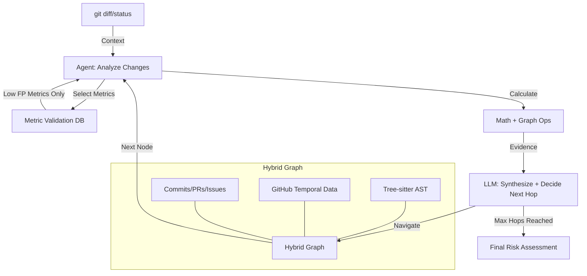

# Software Specification: CodeRisk v1.0

**Version:** 1.0
**Last Updated:** October 1, 2025

---

## 1. Overview

### 1.1. Vision & Mission
CodeRisk is a **pre-flight check tool** that instantly answers: **"Is this change safe to proceed?"** It delivers decisive risk scores through intelligent agentic graph search, becoming as reflexive as `git status` in the developer's workflow. Unlike conversational PR bots or long-term health monitors, CodeRisk acts as a predictive oracle for immediate, critical risk assessment.

### 1.2. Target Audience
**Primary Markets (Priority Order):**
1. **Enterprise Teams** ($5K-50K/month) - Privacy-first, custom endpoints, SOC2 compliance
2. **Development Teams** ($500-5K/month) - Cloud SaaS, shared ingestion model
3. **OSS Projects** ($100-1K/month) - Sponsor-funded public caches

**Core Users:**
- **Ben (Developer)** - Fears unknown unknowns like hidden couplings, needs instant pre-commit safety check
- **Clara (Tech Lead)** - Needs data-backed evidence (G² Surprise) to validate architectural intuition
- **Team Developers** - Need automated QA before pushing changes affecting teammates

### 1.3. Guiding Principles
- **Intelligent Performance:** 2-5 second response via agentic graph search with hop limits (not brute-force analysis)
- **Zero-Friction Adoption:** Auto-discovery of team caches, instant access to public repos, works immediately after `git clone`
- **Explainable Intelligence:** Every risk score includes clear evidence, reasons, and actionable fixes from graph traversal
- **Shared Cache Model:** Public repos cached once (99% storage reduction), private repos isolated with team sharing
- **Cloud-First, BYOK:** User provides LLM API keys, we host storage/compute/graph infrastructure
- **Privacy-First:** Private repos with GitHub OAuth verification, enterprise keeps all data in customer infrastructure
- **High Signal, Low Noise:** Fewer robust metrics with low false positive rates, not many inaccurate metrics

### 1.4. Differentiation from Competitors
- **vs. Greptile (Conversational PR Co-pilot):** CodeRisk provides decisive pre-commit checks via agentic graph search, not PR comment conversations
- **vs. Codescene (Health Monitor):** CodeRisk delivers immediate risk signals through intelligent investigation, not long-term health dashboards
- **Unique Value:** Cloud-first SaaS with shared public caching (instant access to React, Kubernetes, etc.), agentic graph search combining tree-sitter AST + GitHub temporal data with LLM reasoning, BYOK model with 70-85% infrastructure cost savings vs competitors

### 1.5. Scope (v1.0)
**In Scope:**
- CLI tool (`crisk`) with commands: `init`, `check`, `pull`, `status`, `config`
- **Agentic Graph Search:** LLM-driven investigator that traverses code graph with hop limits for cost efficiency
- **Hybrid Graph:** Tree-sitter AST (code structure) + GitHub temporal data (PRs, issues, commits)
- **High-Signal Metrics Only:** Validated low false-positive metrics selected by agent during investigation
- **Cloud-First Architecture:** Amazon Neptune Serverless (graph), PostgreSQL (metadata), Redis (cache)
- **BYOK Model:** Users provide OpenAI/Anthropic API keys, we host infrastructure
- **Public Repository Caching:** Shared cache for public repos (React, Kubernetes, etc.) with reference counting
- **Multi-Branch Support:** Base graph (main) + delta graphs (branches) with 98% size reduction
- **Settings Portal:** Web UI for API key configuration, team management, billing
- Deployment modes: Enterprise (self-hosted), Team (cloud SaaS), OSS (public cache)

**Out of Scope (v1.0):**
- Web dashboard for graph visualization (CLI-first, portal for settings only)
- Real-time collaborative features
- IDE extensions (future)
- Static predetermined metric sets (replaced by agent-selected metrics)

### 1.6. Supporting Documentation

This specification is the **single source of truth** for requirements, architecture, and business logic. Supporting documents are organized by concern area. See **[README.md](README.md)** for full navigation.

**Core Architecture (Read First):**

1. **[01-architecture/cloud_deployment.md](01-architecture/cloud_deployment.md)** - Cloud infrastructure, BYOK model, pricing tiers, security
   - **When to read:** Understanding deployment strategy, cost model, infrastructure components
   - **Key topics:** Neptune Serverless, Kubernetes, PostgreSQL, API key security, multi-tenancy

2. **[01-architecture/graph_ontology.md](01-architecture/graph_ontology.md)** - Five-layer graph structure, relationship types, inference rules
   - **When to read:** Understanding the graph data model and how entities/relationships are structured
   - **Key topics:** Syntactic/semantic/behavioral/risk/causal layers, relationship inference, density targets

3. **[01-architecture/agentic_design.md](01-architecture/agentic_design.md)** - Agent investigation strategy, hop-by-hop navigation, spatial context
   - **When to read:** Understanding how the agent navigates graphs and makes risk decisions
   - **Key topics:** Investigation loop, metric validation, spatial memory, termination conditions

4. **[01-architecture/risk_assessment_methodology.md](01-architecture/risk_assessment_methodology.md)** - Risk calculation formulas, thresholds, metric validation
   - **When to read:** Understanding how risk metrics are calculated and validated
   - **Key topics:** Tier 1/2 metrics, coupling/co-change/test ratio formulas, FP tracking, heuristic logic

5. **[01-architecture/prompt_engineering_design.md](01-architecture/prompt_engineering_design.md)** - LLM prompt architecture, context management, token budgets
   - **When to read:** Understanding how LLM prompts guide agent investigation
   - **Key topics:** Decision/synthesis prompts, evidence formatting, context window management, error handling

**Operational Strategies (Read for Implementation):**

6. **[02-operations/team_and_branching.md](02-operations/team_and_branching.md)** - Team graph sharing, branch delta strategy, caching
   - **When to read:** Implementing multi-user access and feature branch support
   - **Key topics:** Base + delta architecture, 90% cost reduction, cache invalidation

7. **[02-operations/public_caching.md](02-operations/public_caching.md)** - Shared public repo cache, reference counting, garbage collection
   - **When to read:** Implementing public repository support (React, Kubernetes, etc.)
   - **Key topics:** 99% storage reduction, lifecycle management, access control

**Decision Records (Read for Context):**

8. **[01-architecture/decisions/001-neptune-over-neo4j.md](01-architecture/decisions/001-neptune-over-neo4j.md)** - Neptune vs Neo4j decision rationale
   - **When to read:** Understanding why Neptune Serverless was chosen (70% cost savings)
   - **Key topics:** Cost analysis, trade-offs, migration considerations

**Implementation Tracking:**

9. **[03-implementation/status.md](03-implementation/status.md)** - Current codebase status, MVP blockers, phase roadmap
   - **When to read:** Before starting implementation work, tracking progress
   - **Key topics:** Component status, missing pieces, technology stack, next steps

**Reading Order:**
- **New team members:** Start with this spec.md, then [README.md](README.md) for navigation
- **Before implementing feature:** spec.md (requirements) → relevant architecture/operations doc
- **Making architecture decision:** spec.md (constraints) → [01-architecture/decisions/](01-architecture/decisions/)

---

## 2. Business Requirements

### 2.1. Problem Statement
Developers face acute uncertainty at the moment of creation: "Is it safe to proceed?" Traditional tools fail to address:
- **Architectural regressions** in established patterns (invisible to linters)
- **Temporal coupling** and hidden dependencies
- **Unknown unknowns** in blast radius and downstream impact
- **High false positive rates** from static rule-based systems
- **Pre-commit context** - most tools only work at PR review time (too late)

### 2.2. Strategic Position: The "Pre-Flight Check" Category
**Workflow Moat:** Own the rapid, local, pre-commit sanity check workflow:
```bash
git commit -am "wip" && crisk check  # 5-10s response, decisive answer via intelligent search
```

This addresses developer uncertainty in the chaotic inner loop, long before polished PRs. Competitors (Greptile, Codescene) anchor to formal review cycles; CodeRisk captures the earlier, higher-frequency moment with intelligent investigation.

### 2.3. Goals
- **Prevent architectural regressions** not caught by tests or linters through graph-aware analysis
- **Minimize false positives** via agent-selected, validated metrics (better few accurate than many noisy)
- **Build workflow habit** - `crisk check` becomes as reflexive as `git status`
- **Prove ROI** - Track prediction accuracy (target: >85%), incidents prevented, hours saved

### 2.4. Success Metrics (KPIs)

**Performance Targets:**
- Analysis latency (p50): 2-5s, (p95): 8s (intelligent graph search with hop limits + Neptune)
- Graph traversal: Max 3-5 hops per investigation (cost control)
- API cost per check: <$0.05 (user's LLM API key, we cover infrastructure)
- Cache hit rate: >90% (Redis + Neptune query cache + materialized views)
- Zero-config success: >95% auto-discovery rate
- Public cache hit rate: >80% (users accessing pre-built React, Next.js, etc.)
- Branch delta efficiency: >98% size reduction vs full graph

**Quality Metrics:**
- **False positive rate: <3%** (critical - via validated metric selection)
- Risk detection coverage: >85% (post-incident analysis)
- Incident prediction accuracy: >90% (higher due to intelligent investigation)
- Metric validation rate: >95% (agent only uses proven low-FP metrics)
- User satisfaction: >4.5/5 NPS
- Daily checks per user: >10 (habit formation)

**Business Metrics:**
- Enterprise contracts: Revenue >$5K/month each
- Team adoption: >1,000 teams within 12 months
- OSS sponsorship: >100 sponsored projects

---

## 3. Functional Requirements (User Stories)

### 3.1. Zero-Config Initialization (Critical Success Factor)
- **FR-1:** As a developer, when I run `crisk check` on a public repo (e.g., React), it auto-discovers shared cache and provides instant access (0-2s)
- **FR-2:** As a developer on a private repo, `crisk check` verifies GitHub access via OAuth and connects to team's isolated graph
- **FR-3:** As a team admin, I can run `crisk auth login` to authenticate via GitHub OAuth and configure my OpenAI/Anthropic API key in the settings portal
- **FR-4:** As a repo admin, if no graph exists, `crisk admin init` triggers cloud graph construction (5-10 min build) that team shares
- **FR-5:** As an enterprise user, `crisk init --local-only` performs air-gapped graph construction with local models

### 3.2. Multi-Branch and Cache Management
- **FR-6:** As a developer, when I switch branches, `crisk check` auto-creates branch delta graph (98% smaller than full graph) on-demand
- **FR-7:** As a developer, queries on feature branches use federated query (base + delta) with ~100ms latency overhead
- **FR-8:** As a developer, when I merge/delete a branch, the delta graph is automatically archived/deleted
- **FR-9:** As a developer on a public repo, I reference a shared cache that remains hot while actively used (ref_count > 0)
- **FR-10:** As the system, public caches with ref_count=0 archive to S3 after 30 days, delete after 90 days (garbage collection)
- **FR-41:** As a developer, `crisk init` detects repository languages via GitHub API and loads only required parsers (1-2 instead of 5)
- **FR-42:** As a developer, all Layer 1 nodes (File, Function, Class) store `branch` and `git_sha` properties for branch context
- **FR-43:** As a developer, when I switch branches, `crisk check` uses git diff to parse only changed files (3-5s vs 10s full parse)
- **FR-44:** As a developer, branch deltas use git SHA as source of truth to avoid redundant node duplication

### 3.3. Agentic Risk Assessment (Core Innovation)
- **FR-11:** As a developer, `crisk check` initiates an intelligent agent that analyzes git diff/status to understand code changes
- **FR-12:** As a developer, the agent uses my OpenAI/Anthropic API key for LLM reasoning to select only validated high-signal metrics
- **FR-13:** As a developer, the agent performs graph search with max 3-5 hops via Neptune openCypher queries
- **FR-14:** As a developer, I receive final risk score (LOW/MEDIUM/HIGH/CRITICAL) with evidence trail showing agent's investigation path

### 3.4. Explainable Intelligence
- **FR-15:** As a developer, `crisk check --explain` shows the agent's investigation trace: nodes visited, metrics calculated, reasoning steps
- **FR-16:** As a developer, I see which metrics the agent selected and why (with validation scores)
- **FR-17:** As a developer, I receive actionable suggestions based on agent findings: "Add tests for authenticate()", "Review coupled file X"
- **FR-18:** As a developer, evidence trails link to settings portal for graph visualization and detailed metric calculations

### 3.5. Continuous Learning & Feedback
- **FR-19:** As a developer, I can override HIGH risk with `crisk override --false-positive "reason"` (updates metric validation scores)
- **FR-20:** As a team lead, I can link incidents to commits: `crisk incident link INC-123 --commit abc456` (trains agent selection logic)
- **FR-21:** As a team lead, `crisk stats --accuracy` shows agent accuracy, metric selection effectiveness, investigation efficiency
- **FR-22:** As a developer, the system learns which metrics have high false positives and deprioritizes them in future investigations

### 3.6. Team Administration & Settings Portal
- **FR-23:** As a team admin, I access the settings portal to configure my OpenAI/Anthropic API key (AES-256-GCM encrypted)
- **FR-24:** As a team admin, the portal shows team members, repositories, Neptune graph status, storage usage, and billing
- **FR-25:** As a repo admin, `crisk admin stats` shows team usage, infrastructure costs, graph freshness, agent performance
- **FR-26:** As a repo admin, `crisk admin reingest` triggers full graph reconstruction in Neptune
- **FR-27:** As a repo admin, I can set budget limits: daily ($2), per-check ($0.05), monthly ($60)
- **FR-28:** As a repo admin, I can configure agent hop limits (3-5) and metric validation thresholds in the portal

### 3.7. Deployment-Specific Features

**Enterprise:**
- **FR-29:** As an enterprise admin, I can configure custom LLM endpoints (Azure OpenAI, AWS Bedrock, GCP Vertex AI) for agent reasoning
- **FR-30:** As an enterprise admin, I can enable SAML/OIDC authentication and RBAC
- **FR-31:** As an enterprise admin, all data (graph, metrics, agent traces) stays in customer VPC with self-hosted Neptune

**Team (Cloud SaaS):**
- **FR-32:** As a team, one graph construction (5-10 min) is shared across all developers via GitHub org integration
- **FR-33:** As a team with private repos, GitHub OAuth verifies each member's access before granting graph access
- **FR-34:** As a team, webhooks auto-update main graph on pushes (incremental, low cost)
- **FR-35:** As a team, branch deltas auto-create on-demand (98% smaller, ~10-50MB vs 2GB)
- **FR-36:** As a team, I see agent performance analytics in portal: hop efficiency, metric accuracy, Neptune costs

**OSS (Public Cache):**
- **FR-37:** As a developer adding React/Next.js/Kubernetes, I instantly access shared public cache (first user built it)
- **FR-38:** As the first user of a public repo, I trigger graph build (5-10 min) that benefits all future users
- **FR-39:** As a developer, I contribute to reference count; when all users remove repo, it archives after 30 days
- **FR-40:** As an OSS contributor, I get free access to pre-computed public cache graphs
- **FR-41:** As an OSS project, CodeRisk posts simple status checks on PRs with agent investigation summary

---

## 4. Non-Functional Requirements (System Qualities)

### 4.1. Performance ⚡
- **NFR-1 (Intelligent Speed):** Analysis p50: 2-5s, p95: 8s (agent-driven Neptune graph search with hop limits + caching)
- **NFR-2 (Hop Efficiency):** Max 3-5 graph hops per investigation (prevents exponential cost explosion)
- **NFR-3 (Graph Pre-computation):** Heavy `init` (build tree-sitter AST + GitHub temporal graph in Neptune), light `check` (agent navigates pre-built graph)
- **NFR-4 (Cold Start Latency):** Neptune Serverless cold start: 100-500ms (acceptable for infrequent repos)
- **NFR-5 (Graph Size):** Base graph ~2GB (main branch), branch deltas ~10-50MB (98% reduction), public cache ~155MB (React-sized)

### 4.2. Scalability & Cost Efficiency 💰
- **NFR-6 (Public Cache Efficiency):** One React graph shared by 1,000 users = 99% storage reduction (155MB vs 155GB)
- **NFR-7 (Team Sharing):** One graph per repo shared by team (90% reduction vs per-user graphs)
- **NFR-8 (Branch Delta Efficiency):** Branch deltas 98% smaller than full graphs (10-50MB vs 2GB)
- **NFR-9 (BYOK Cost Model):** User pays LLM API costs (~$0.05/check), we cover infrastructure (~$2.45/user/month at 1K users)
- **NFR-10 (Infrastructure Cost - 1K users):**
  - Neptune Serverless: $545/month (70-85% savings vs Neo4j Aura)
  - PostgreSQL: $350/month
  - Redis: $200/month
  - Kubernetes: $1,050/month
  - Total: $2,445/month ($2.45/user)
- **NFR-11 (Garbage Collection):** Public caches with ref_count=0 archive to S3 after 30 days, delete after 90 days

### 4.3. Security & Privacy 🔒
- **NFR-12 (API Key Security):** AES-256-GCM encryption at rest, decrypted only at request time, never logged
- **NFR-13 (Private Repo Isolation):** GitHub OAuth verification required, isolated Neptune databases per organization
- **NFR-14 (Public Cache Access):** Read-only shared cache for public repos, verified via GitHub API
- **NFR-15 (Data Locality - Enterprise):** No source code, graph data, or agent traces transmitted over network in enterprise deployments
- **NFR-16 (Encryption):** Customer-managed keys (enterprise), AES-256 at rest (team), TLS 1.3 in transit
- **NFR-17 (Multi-Tenant Isolation):** Strict per-organization separation at PostgreSQL + Neptune level (row-level security)
- **NFR-18 (Access Control):** RBAC with audit trails (enterprise), GitHub OAuth with MFA (team), read-only public (OSS)
- **NFR-19 (Compliance):** SOC2, HIPAA, GDPR ready for enterprise deployments
- **NFR-20 (Supply Chain Security):** Signed binaries, checksum verification, automated dependency scanning
- **NFR-28 (Branch Isolation):** Layer 1 nodes branch-specific, Layers 2-3 branch-agnostic (git history shared across branches)
- **NFR-29 (Incremental Delta Efficiency):** Branch delta creation 3-5s via git diff (only parse changed files, not entire codebase)

### 4.4. Reliability & Availability
- **NFR-21 (Cloud-First Availability):** Neptune Serverless auto-scales 0.5-128 NCUs, handles spikes gracefully
- **NFR-22 (Graceful Degradation):** If Neptune cold start >500ms, show progress indicator; if timeout, use cached results
- **NFR-23 (Error Recovery):** `crisk graph verify` detects corruption, `crisk graph repair` triggers Neptune rebuild
- **NFR-24 (Agent Fault Tolerance):** If LLM fails during investigation, agent falls back to rule-based navigation
- **NFR-25 (Cache Restoration):** Archived public caches restore from S3 in <2 minutes when accessed

### 4.5. Usability (Developer Experience)
- **NFR-26 (Zero-Config Onboarding):** Public repos: instant access (0-2s), private repos: GitHub OAuth + auto-discovery (<1 min)
- **NFR-27 (Settings Portal UX):** Simple web UI for API key config, team management, billing - no complex setup
- **NFR-28 (CLI Output Clarity):** Shows agent investigation trace, selected metrics, reasoning steps in readable format
- **NFR-29 (Explainability):** Every score backed by agent's investigation path, hop-by-hop decisions, metric validation
- **NFR-30 (Human Override Support):** Easy override with reason tracking, feeds into metric validation database

---

## 5. Technical & Infrastructure Requirements

### 5.1. Architecture: Agentic Graph Search (Core Innovation)

**Paradigm Shift:**
- **From:** Static predetermined metrics with high false positive rates
- **To:** Intelligent agent that selects validated metrics during graph investigation



### 5.2. Technology Stack

**Core Stack (Current - 3,868 LOC, 92% Complete):**
- **Language:** Go 1.21+
- **CLI Framework:** Cobra (✅ fully implemented)
- **Configuration:** Viper (✅ fully implemented)
- **Cloud Database:** PostgreSQL with connection pooling (✅ fully implemented) - team/user metadata, access control
- **Local Cache:** SQLite with WAL mode (✅ fully implemented) - CLI-side caching

**Dependencies (All 11 Actively Used):**
```go
require (
    github.com/google/go-github/v57 v57.0.0      // GitHub API client
    github.com/jackc/pgx/v5 v5.5.1               // PostgreSQL driver
    github.com/jmoiron/sqlx v1.3.5               // SQL extensions
    github.com/joho/godotenv v1.5.1              // .env file support
    github.com/mattn/go-sqlite3 v1.14.18         // SQLite driver
    github.com/patrickmn/go-cache v2.1.0+incompatible  // In-memory cache
    github.com/sirupsen/logrus v1.9.3            // Structured logging
    github.com/spf13/cobra v1.8.0                // CLI framework
    github.com/spf13/viper v1.18.2               // Configuration
    golang.org/x/sync v0.5.0                     // Synchronization primitives
    golang.org/x/time v0.5.0                     // Rate limiting
)
```

**New Cloud Integrations (Cloud-First Architecture):**
- ✅ **Amazon Neptune Serverless** - Graph database (openCypher queries), auto-scaling 0.5-128 NCUs
- ✅ **Redis (ElastiCache)** - Three-layer caching (15-min TTL, 35% hit rate)
- ✅ **Tree-sitter** - AST parsing for code structure graph
- ✅ **LLM Client** (OpenAI/Anthropic via user's API key) - Agent reasoning and synthesis
- ✅ **Kubernetes (EKS)** - Microservices orchestration
- ✅ **S3** - Public cache archival, cold storage
- ✅ **Settings Portal** - Next.js web UI for API key config, team management, billing

**NOT Using:**
- ❌ Cognee (removed, was causing 500ms+ overhead)
- ❌ LanceDB (replaced with Neptune)
- ❌ Neo4j Aura (replaced with Neptune Serverless - 70-85% cost savings)
- ❌ Static embedding-based search (replaced with agentic navigation)
- ❌ Local-first architecture (replaced with cloud-first, BYOK model)

### 5.3. Agentic Graph Search Implementation

**Agent Architecture:**

```python
class RiskInvestigationAgent:
    """Intelligent agent for graph-based risk investigation"""

    def __init__(self, llm_client, graph, metric_validator):
        self.llm = llm_client
        self.graph = graph  # Hybrid: tree-sitter AST + GitHub temporal
        self.validator = metric_validator
        self.max_hops = 5
        self.visited_nodes = set()

    async def investigate(self, git_diff) -> RiskAssessment:
        # 1. Analyze initial context
        context = self.analyze_diff(git_diff)
        current_node = self.find_start_node(context)

        # 2. Begin investigation
        for hop in range(self.max_hops):
            # Get validated metrics for this node
            available_metrics = self.validator.get_low_fp_metrics(current_node)

            # Calculate metrics (math + graph operations)
            metric_results = self.calculate_metrics(current_node, available_metrics)

            # LLM synthesizes results and decides next hop
            decision = await self.llm.synthesize_and_decide(
                current_node=current_node,
                metrics=metric_results,
                context=context,
                hop_number=hop
            )

            if decision.confidence > 0.9:
                # High confidence, can terminate early
                break

            # Navigate to next node
            current_node = self.navigate_to(decision.next_node)
            self.visited_nodes.add(current_node)

        # 3. Generate final assessment
        return self.generate_assessment(self.visited_nodes, metric_results)

    def calculate_metrics(self, node, available_metrics):
        """Only calculate validated low-FP metrics"""
        results = {}
        for metric in available_metrics:
            if metric.false_positive_rate < 0.03:  # <3% FP rate
                results[metric.name] = metric.calculate(node, self.graph)
        return results
```

**Metric Validation System:**

```python
class MetricValidator:
    """Tracks false positive rates and validates metrics"""

    def __init__(self, validation_db):
        self.db = validation_db
        self.fp_threshold = 0.03  # 3% max FP rate

    def get_low_fp_metrics(self, node_type) -> List[Metric]:
        """Return only metrics with proven low FP rates"""
        all_metrics = self.get_available_metrics(node_type)
        validated = []

        for metric in all_metrics:
            fp_rate = self.db.get_fp_rate(metric.name)
            if fp_rate < self.fp_threshold:
                validated.append(metric)

        return validated

    def record_override(self, metric_name, was_false_positive: bool):
        """Learn from human overrides"""
        self.db.update_fp_rate(metric_name, was_false_positive)
```

### 5.4. Hybrid Graph Construction

**Graph Components:**

```yaml
hybrid_graph:
  code_structure:
    source: tree-sitter
    nodes:
      - functions
      - classes
      - imports
      - call_sites
    edges:
      - calls
      - imports
      - contains

  temporal_data:
    source: github_api
    nodes:
      - commits
      - pull_requests
      - issues
      - developers
    edges:
      - modifies (commit -> file)
      - references (PR -> issue)
      - authors (developer -> commit)
      - co_changes (file <-> file, temporal coupling)

  integration:
    - link tree-sitter functions to git commits
    - link issues to affected code nodes
    - compute temporal coupling between AST nodes
```

**Storage Architecture:**

```
Cloud Infrastructure:
├── Amazon Neptune Serverless (Graph Database)
│   ├── neptune_public_repo_facebook_react_main      # Shared public cache
│   ├── neptune_public_repo_vercel_nextjs_main       # Shared public cache
│   ├── neptune_org_acme123_repo_xyz_main            # Private base graph
│   └── neptune_org_acme123_repo_xyz_feature_auth    # Private branch delta
│
├── PostgreSQL (Metadata)
│   ├── users (id, github_username, oauth_token, api_key_encrypted)
│   ├── teams (id, name, billing_plan)
│   ├── repositories (id, github_org, github_repo, is_public, neptune_db_name, reference_count, state)
│   ├── repository_access (repo_id, user_id, team_id, github_access_verified)
│   └── branch_deltas (id, repo_id, branch_name, neptune_db_name, size_bytes, created_at)
│
├── Redis (ElastiCache)
│   ├── investigation_cache (15-min TTL, 35% hit rate)
│   ├── metric_cache (daily updates, 55% hit rate)
│   └── materialized_views (95% hit rate)
│
├── S3 (Cold Storage)
│   ├── archived_public_caches/neptune_public_repo_*_snapshot.tar.gz
│   └── graph_backups/
│
└── Local CLI Cache (.coderisk/)
    ├── auth_token.enc         # Encrypted GitHub OAuth token
    ├── config.yaml            # CLI configuration
    ├── graph_metadata.json    # Neptune connection info
    └── logs/
        ├── agent_decisions.jsonl
        └── performance.jsonl
```

### 5.5. LLM Strategy for Agent Reasoning

**Tiered LLM Selection:**

| Tier | Model | Use Case | Cost | Latency |
|------|-------|----------|------|---------|
| **Level 1** | Qwen2.5-Coder-1.5B | Local reasoning, quick decisions | $0 | 0.2-0.5s/hop |
| **Level 2** | DeepSeek-Coder-V2-Lite-7B | Enhanced analysis, complex synthesis | $0 (local) | 0.6-1.2s/hop |
| **Level 3** | GPT-4o-mini | Full cloud analysis, highest accuracy | $0.15/$0.60 per 1M tokens | 1-2s/hop |

**Agent Reasoning Prompt Template:**

```
You are a code risk investigation agent. Current state:
- Node: {current_node}
- Hop: {hop_number}/{max_hops}
- Available metrics: {validated_metrics}
- Metric results: {results}
- Git changes: {diff_context}

Calculate risk signals from metrics. Synthesize findings.
Decide: Continue investigation or finalize assessment?

If continuing:
1. Which metric has highest signal for next hop?
2. Which connected node to investigate next?
3. Reasoning for selection?

If finalizing:
1. Overall risk level (LOW/MEDIUM/HIGH/CRITICAL)?
2. Top 3 risk factors with evidence?
3. Actionable suggestions?

Response format: {structured_json}
```

### 5.6. Deployment Models

**1. Enterprise (Privacy-First, Self-Hosted):**
```yaml
components:
  graph: customer_neptune (self-hosted in VPC)
  storage: customer_s3_compatible
  llm: custom_endpoint (Azure/AWS/GCP) or local_ollama
  tree_sitter: local_parsing
  auth: SAML/OIDC
  data_residency: 100% customer infrastructure
agent_config:
  max_hops: 5 (configurable)
  fp_threshold: 0.03
  llm_timeout: 10s/hop
pricing: $5K-50K/month (10-100+ developers)
infrastructure_cost: Customer-managed
```

**2. Team (Cloud SaaS, BYOK Model):**
```yaml
components:
  graph: amazon_neptune_serverless (multi-tenant, isolated DBs)
  storage: s3_encrypted (per-org isolation)
  llm: user_api_key (OpenAI/Anthropic - BYOK)
  tree_sitter: cloud_service
  auth: GitHub OAuth
  webhooks: auto_update_graph
  public_cache: shared_neptune_db (reference counted)
  private_repos: isolated_neptune_db (team shared)
  branch_strategy: base_graph + delta_graphs (98% reduction)
agent_config:
  max_hops: 3 (cost optimized)
  fp_threshold: 0.03
  budget_cap: $0.05/check (user's LLM API)
pricing:
  - Free: 1 user, 3 repos, 100 checks/month
  - Pro ($9/user/month): Unlimited repos, 1K checks/month
  - Team ($29/user/month): Team sharing, 5K checks/month, priority support
infrastructure_cost: $2.45/user/month (we cover)
```

**3. OSS (Public Cache, Free Access):**
```yaml
components:
  graph: shared_neptune_public_cache
  storage: public_s3 (archive after 30 days if ref_count=0)
  llm: user_api_key (optional, for advanced features)
  tree_sitter: cached_results
  access: authenticated_github_user (read-only)
  reference_counting: automatic (add/remove when user adds/removes repo)
  garbage_collection: archive (30 days), delete (90 days)
agent_config:
  max_hops: 3
  fp_threshold: 0.05 (slightly relaxed)
  llm: user_api_key or fallback to heuristics
pricing:
  - Free for OSS contributors
  - First user triggers build (5-10 min wait)
  - Subsequent users: instant access (0-2s)
infrastructure_cost: $0.05-0.30/popular repo/month (amortized across all users)
```

---

## 6. Constraints

### 6.1. Technical Constraints
- **C-1 (Current Codebase):** 3,868 LOC Go implementation (92% complete), must build on existing foundation
- **C-2 (Missing Critical Stubs):** Git detection (`detectGitRepo`, `parseRepoURL`, `getChangedFiles`) must be implemented for MVP
- **C-3 (Neptune Compatibility):** Use openCypher query language (95% Cypher compatible), not full Cypher
- **C-4 (Performance Target):** Agent investigation must complete in 2-5s (p50), 8s (p95) including Neptune cold start
- **C-5 (Cold Start Tolerance):** Neptune Serverless cold start 100-500ms acceptable for infrequent repos

### 6.2. Resource Constraints
- **C-6 (Hop Limits):** Max 3-5 graph hops per investigation (prevents exponential cost explosion)
- **C-7 (Budget Governance - User LLM):** User pays ~$0.05/check via their API key
- **C-8 (Budget Governance - Infrastructure):** We cover $2.45/user/month at 1K users ($2,445 total)
- **C-9 (Neptune Auto-Scaling):** 0.5 NCUs (idle) to 128 NCUs (peak), auto-scales based on load
- **C-10 (FP Rate Mandate):** Metrics with >3-5% false positive rate automatically excluded

### 6.3. Business Constraints
- **C-11 (BYOK Model):** Users provide and manage their own LLM API keys, we cover infrastructure
- **C-12 (Public Cache Economics):** Must achieve 80%+ cache hit rate for public repos to justify shared storage
- **C-13 (Privacy Commitment):** Private repos must verify GitHub access via OAuth before granting graph access
- **C-14 (Open Source Core):** CLI tool + agent framework open source (MIT/Apache 2.0), enterprise features closed source
- **C-15 (Deployment Flexibility):** Single codebase supports enterprise, team, and OSS with configuration-based switching

---

## 7. Risks & Mitigation Plan ⚠️

| Risk ID | Description | Probability | Impact | Mitigation Strategy |
|---------|-------------|-------------|--------|---------------------|
| **R-1** | Neptune cold start >500ms impacts user experience | Medium | Medium | Show progress indicator, use Redis caching heavily, keep popular repos warm via reference counting |
| **R-2** | Public cache storage costs exceed budget | High | High | Aggressive garbage collection (30/90 day archive/delete), monitor reference counts, archive unpopular repos |
| **R-3** | User API keys leaked or misused | High | Critical | AES-256-GCM encryption, never log keys, audit all key access, provide key rotation UI |
| **R-4** | Metric validation insufficient, >3% FP rate persists | Medium | Critical | Rigorous backtesting on OSS projects, continuous feedback loop, A/B test metric selection |
| **R-5** | Private repo access verification bypass | High | Critical | Always verify GitHub OAuth, check collaborator status via API, audit all access attempts |
| **R-6** | Graph construction too expensive (>5-10 min) | Medium | High | Incremental graph building, cache tree-sitter results, batch GitHub API calls, parallel processing |
| **R-7** | Branch delta size >5% of base graph | Medium | Medium | Optimize delta calculation, only include truly changed nodes, compress deltas |
| **R-8** | Zero-config auto-discovery fails (no graph found) | Medium | Medium | For public repos: offer to trigger build, for private repos: check OAuth and trigger build |
| **R-9** | Infrastructure costs exceed $2.45/user revenue | High | Critical | Monitor Neptune usage, optimize query patterns, use caching aggressively, scale Neptune down when idle |

---

## 8. Glossary

**Core Concepts:**
- **Agentic Graph Search:** LLM-driven investigator that navigates hybrid graph (tree-sitter AST + GitHub temporal) using math calculations + reasoning to select next node
- **Hybrid Graph:** Combined graph of code structure (tree-sitter AST) + temporal data (GitHub commits/PRs/issues/co-changes) stored in Amazon Neptune Serverless
- **Public Repository Cache:** Shared graph for public repos (e.g., React, Next.js) with reference counting and lifecycle management (99% storage reduction)
- **Branch Delta Graph:** Lightweight graph containing only changes from main branch (98% smaller, ~10-50MB vs 2GB)
- **BYOK (Bring Your Own Key):** User provides OpenAI/Anthropic API key for LLM calls, we cover infrastructure
- **Reference Counting:** Track number of users accessing a public cache; archive when ref_count=0 for 30+ days
- **Hop Limit:** Max number of graph nodes agent can visit (3-5) to control costs and latency
- **Metric Validation:** System tracking false positive rates per metric, auto-excluding metrics >3% FP rate
- **Agent Investigation Trace:** Full log of agent's decisions: nodes visited, metrics calculated, reasoning steps, synthesis

**Technical Terms:**
- **Tree-sitter AST:** Abstract syntax tree parsed from source code showing structure (functions, classes, calls, imports)
- **Temporal Coupling:** Files that frequently change together in commits, even without direct code dependencies
- **False Positive Rate (FP Rate):** Percentage of risk warnings that were incorrect, tracked per metric
- **Hop:** Single step in agent's graph traversal: analyze node → calculate metrics → LLM decide next node
- **Evidence Trail:** Linkable chain from final risk score → agent hops → metric calculations → graph nodes

**Deployment Models:**
- **Enterprise Deployment:** Self-hosted Neptune in customer VPC, custom LLM endpoints, SAML/OIDC auth, complete data isolation
- **Team Deployment (Cloud SaaS):** Neptune Serverless multi-tenant, GitHub OAuth, shared graphs per repo, BYOK for LLM, branch deltas, public cache support
- **OSS Deployment (Public Cache):** Shared Neptune public cache, reference-counted lifecycle, free for contributors, first user triggers build

**Performance Metrics:**
- **Hop Efficiency:** Average hops needed to reach conclusion (lower = better, target: 2-3 average)
- **Metric Selection Accuracy:** % of agent-selected metrics that proved useful (target: >90%)
- **Investigation Latency:** Time per hop (target: 1-2s) and total investigation time (target: 5-10s)
- **False Positive Rate:** Overall % of incorrect risk warnings (target: <3%)

**Algorithms:**
- **Agent Synthesis:** LLM combines metric results + graph context → decides next investigation step
- **Metric Validation:** Tracks FP rate from user overrides + incident feedback → auto-excludes high-FP metrics
- **Graph Pruning:** Pre-filters graph nodes unlikely to contain risk signals (optimization)
- **Temporal Analysis:** Statistical detection of co-changing files from commit history

**Workflow Terms:**
- **Heavy Init, Light Check:** Build full hybrid graph once in Neptune (5-10 min), agent navigates pre-built graph (2-5s)
- **Zero-Config Onboarding:** Public repos: instant access via shared cache, private repos: GitHub OAuth + auto-discover team graph
- **Agent-Selected Metrics:** Metrics chosen dynamically by agent during investigation (not predetermined), filtered by FP rate
- **Validation-Driven Development:** Continuous metric validation from feedback, auto-improvement of metric selection
- **Three-Tier Storage:** Hot (Neptune active), Warm (Neptune scalable), Cold (S3 archive) based on reference count and last access
- **Garbage Collection:** Automatic archival (30 days no access) and deletion (90 days) of unused public caches
